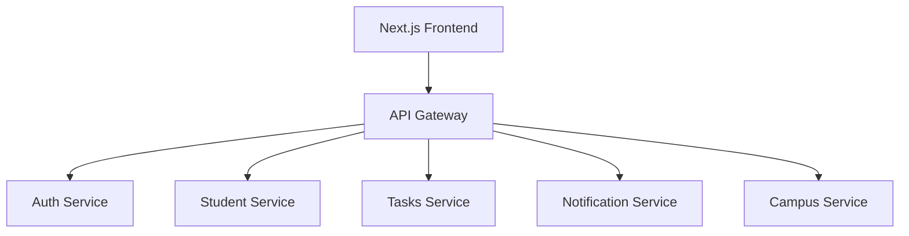
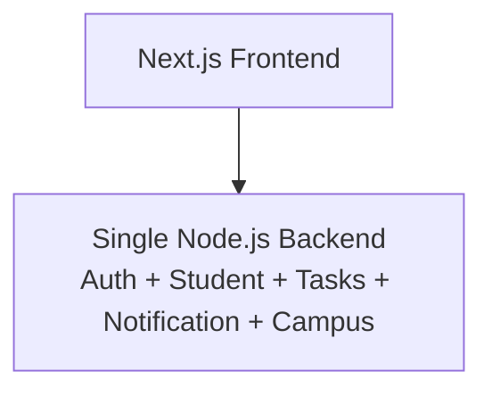
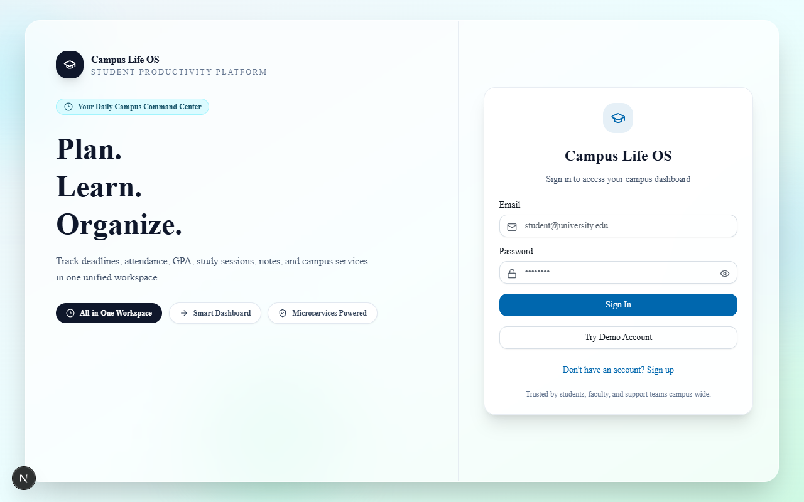
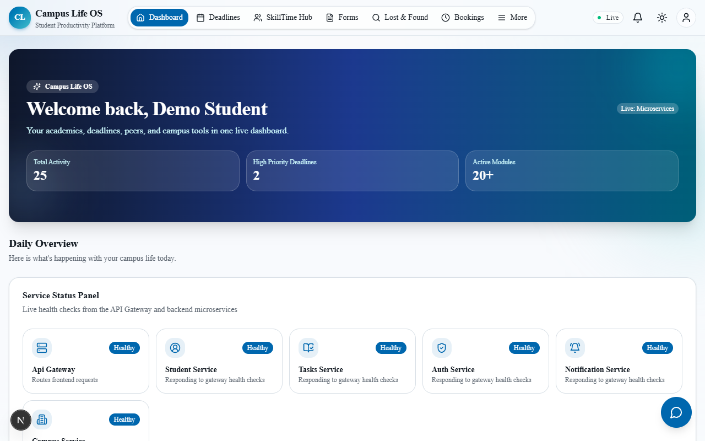
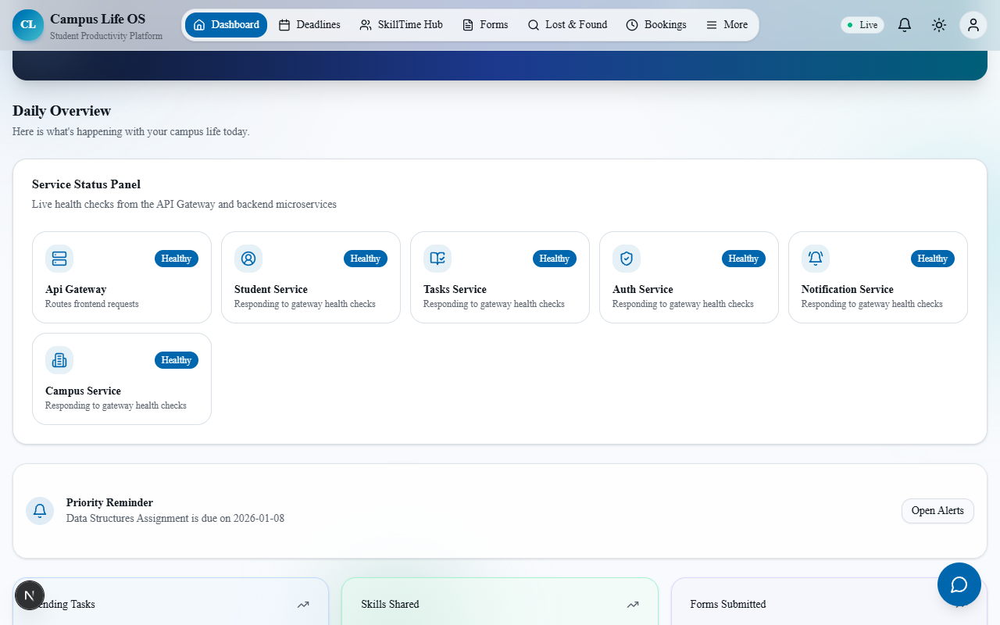
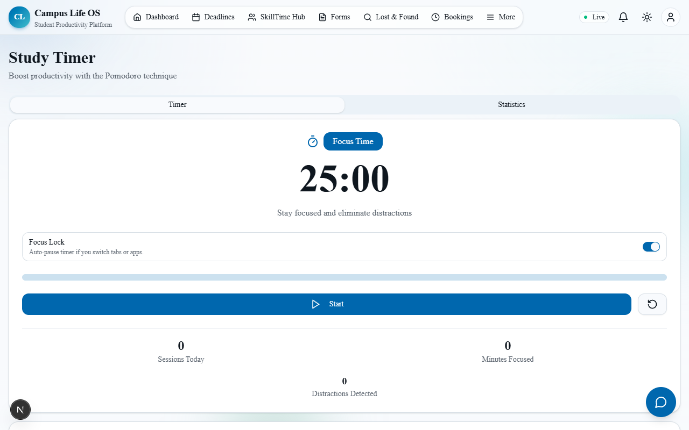

# Campus Life OS


A full-stack campus productivity platform built with a Next.js frontend and Node.js + Express backends that support both microservices and monolithic architecture modes.

Campus Life OS brings common student workflows—authentication, academic tracking, campus utilities, reminders, and notifications—into one unified interface.

## Local Preview

- Frontend: `http://localhost:3000`
- API Gateway Health: `http://localhost:4000/api/services/health`

**Demo login:**  
`demo@university.edu` / `demo123`

## Project Overview

Campus Life OS is designed as a portfolio-grade microservice architecture project with a modern web UI.

### Goals

- Provide a single dashboard for student life operations
- Demonstrate scalable backend design using microservices
- Keep frontend and backend decoupled via an API Gateway
- Support local development and optional containerized execution

## Features

### Frontend (Next.js)

- Authentication UI (login/register)
- Dashboard summary and service status
- Attendance tracking
- GPA calculator
- Deadline manager
- Notes sharing
- Ride sharing
- Campus map and directory
- Lost & Found workflows
- Study timer with focus lock behavior

### Backend (Microservices)

- API Gateway for unified routing
- Auth Service for register/login/JWT workflows
- Student Service for student-related data
- Tasks Service for task/deadline endpoints
- Notification Service for notifications
- Campus Service for campus modules (map, rides, notes, HelpBot)

### Backend (Monolithic)

- Single Node.js + Express backend implementation at `backend/monolith`
- Includes the same core domains: auth, students, tasks, notifications, and campus
- Provides equivalent health, auth, and dashboard APIs for comparison with microservices mode

## Microservices Overview

| Service | Port | Responsibility | Example Endpoints |
| --- | ---: | --- | --- |
| API Gateway | 4000 | Single entry point routing requests | `/api/services/health` |
| Auth Service | 4003 | Authentication & JWT workflow | `/api/auth/login` |
| Student Service | 4001 | Student domain APIs | `/api/*` |
| Tasks Service | 4002 | Tasks & deadlines APIs | `/api/*` |
| Notification Service | 4004 | Notification delivery | `/api/*` |
| Campus Service | 4005 | Campus modules & HelpBot | `/api/helpbot/chat` |

## Architecture Diagram



## Architecture Modes

### Microservices Architecture (Implemented)

This is the primary architecture used in the current project codebase.

- Frontend and backend are decoupled.
- Backend domains are split into independent services.
- API Gateway is the single entry point for client requests.

### Monolithic Architecture (Implemented)

An actual monolithic backend is implemented at `backend/monolith` for academic comparison with the microservices setup.

- A single backend app would contain all modules (auth, students, tasks, notifications, campus) in one deployable unit.
- All features would share one server process and one runtime lifecycle.
- Simpler initial setup, but less independent scaling and deployment flexibility.



Note: The default project mode remains microservices-first, with monolith available as an alternate run mode.

## Tech Stack

### Frontend

- Next.js (App Router)
- React + TypeScript
- Tailwind CSS
- shadcn/ui components

### Backend

- Node.js
- Express.js
- JWT Authentication
- REST APIs

### DevOps

- Docker + Docker Compose
- npm scripts

## Key Concepts Demonstrated

- Microservice architecture design
- API Gateway routing pattern
- JWT authentication flow
- Frontend-backend decoupling
- Containerized development workflow

## Project Structure

```bash
campus-life-os-project/
├── frontend/
│   ├── app/
│   ├── components/
│   ├── lib/
│   └── package.json
├── backend/
│   ├── monolith/
│   │   ├── server.js
│   │   └── package.json
│   ├── services/
│   │   ├── api-gateway/
│   │   ├── auth-service/
│   │   ├── student-service/
│   │   ├── tasks-service/
│   │   ├── notification-service/
│   │   └── campus-service/
│   ├── docker-compose.microservices.yml
│   └── MICROSERVICES.md
└── README.md
```

## API Examples

**Base URL:**

```bash
http://localhost:4000
```

### Health Check

```bash
curl http://localhost:4000/api/services/health
```

### Login

```bash
curl -X POST http://localhost:4000/api/auth/login \
  -H "Content-Type: application/json" \
  -d '{"email":"demo@university.edu","password":"demo123"}'
```

### Register

```bash
curl -X POST http://localhost:4000/api/auth/register \
  -H "Content-Type: application/json" \
  -d '{"name":"Alice","email":"alice@university.edu","password":"alice123"}'
```

## Setup & Run

### Prerequisites

- Node.js 20+
- npm 9+
- Docker (optional)

Create local env file first:

```bash
cd frontend
cp .env.example .env.local
```

On Windows PowerShell:

```powershell
Set-Location frontend
Copy-Item .env.example .env.local
```

Install dependencies:

```bash
cd frontend
npm install
npm run monolith:install
npm run microservices:install
```

### Run Mode A: Microservices

Start backend services and gateway:

```bash
cd frontend
npm run microservices:dev
```

Then start frontend:

```bash
cd frontend
npm run dev
```

Open:

- `http://localhost:3000`
- `http://localhost:4000/api/services/health`

### Run Mode B: Monolithic

Start monolithic backend:

```bash
cd frontend
npm run monolith:dev
```

Then start frontend:

```bash
cd frontend
npm run dev
```

Open:

- `http://localhost:3000`
- `http://localhost:4000/api/services/health`

Optional Docker run:

```bash
cd frontend
npm run microservices:docker
```

## Screenshots

### Login Page



### Dashboard



### Service Status Panel



### Study Timer



## Portfolio Notes

This project showcases:

- Microservice architecture design in Node.js
- API Gateway-based service orchestration
- Full-stack integration with a modern Next.js frontend
- Modular, feature-driven UI components
- Local + containerized development workflows

## Submission Status

- GitHub repository submission is the current delivery mode.
- Cloud deployment config files (`render.yaml`, `vercel.json`) are intentionally removed for now.

## License

This project is for educational and portfolio use. Add a license file if you plan to open-source it publicly.
