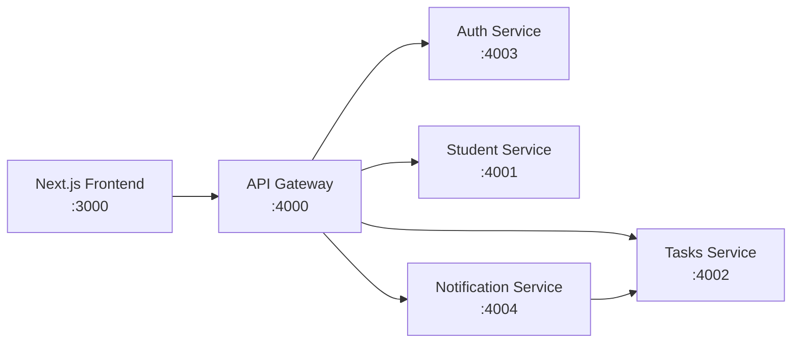

# Microservice Architecture

This project demonstrates a student-friendly microservice setup with five backend services behind one API Gateway.

## Services

- `api-gateway` (`4000`) - Single entry point for frontend.
- `student-service` (`4001`) - Student profile and dashboard stats.
- `tasks-service` (`4002`) - Deadlines and task data.
- `auth-service` (`4003`) - JWT login and token verification.
- `notification-service` (`4004`) - Task reminders and alerts.

## Folder Structure

```text
frontend/
   app/
   components/
   lib/
      api-gateway.ts           # frontend API client to gateway
backend/
   services/
      api-gateway/
         routes/
         controller/
         models/
         config/
         server.js
         package.json
      student-service/
         routes/
         controller/
         models/
         config/
         server.js
         package.json
      tasks-service/
         routes/
         controller/
         models/
         config/
         server.js
         package.json
      auth-service/
         routes/
         controller/
         models/
         config/
         server.js
         package.json
      notification-service/
         routes/
         controller/
         models/
         config/
         server.js
         package.json
      campus-service/
         routes/
         controller/
         models/
         config/
         server.js
         package.json
   docker-compose.microservices.yml
   MICROSERVICES.md
```

## Example API Routes

### API Gateway (`http://localhost:4000`)
- `GET /health`
- `GET /api/services/health`
- `POST /api/auth/login`
- `GET /api/auth/verify`
- `GET /api/students/profile`
- `GET /api/students/stats`
- `GET /api/tasks/deadlines`
- `GET /api/notifications/reminders`
- `POST /api/notifications/alert`
- `GET /api/dashboard-summary`

### Student Service (`http://localhost:4001`)
- `GET /health`
- `GET /api/students/profile`
- `GET /api/students/stats`

### Tasks Service (`http://localhost:4002`)
- `GET /health`
- `GET /api/tasks/deadlines`

### Auth Service (`http://localhost:4003`)
- `GET /health`
- `POST /api/auth/login`
- `GET /api/auth/verify`

### Notification Service (`http://localhost:4004`)
- `GET /health`
- `GET /api/notifications/reminders`
- `POST /api/notifications/alert`

## Frontend -> Gateway Calls

Frontend calls are centralized in `frontend/lib/api-gateway.ts`.

- Login call example:
   - `POST /api/auth/login`
- Dashboard data call example:
   - `GET /api/dashboard-summary`
- Reminder call example:
   - `GET /api/notifications/reminders`

The `AuthPage` and `Dashboard` components use this client.

## Run with npm

1. `cd frontend`
2. `npm install`
3. `npm run microservices:install`
4. `npm run microservices:dev`
5. In another terminal: `cd frontend && npm run dev`

## Run with Docker

- `docker compose -f backend/docker-compose.microservices.yml up --build`

## Frontend Environment

Create `.env.local` from `.env.local.example` and set:

- `NEXT_PUBLIC_API_GATEWAY_URL=http://localhost:4000`

## Architecture Diagram


